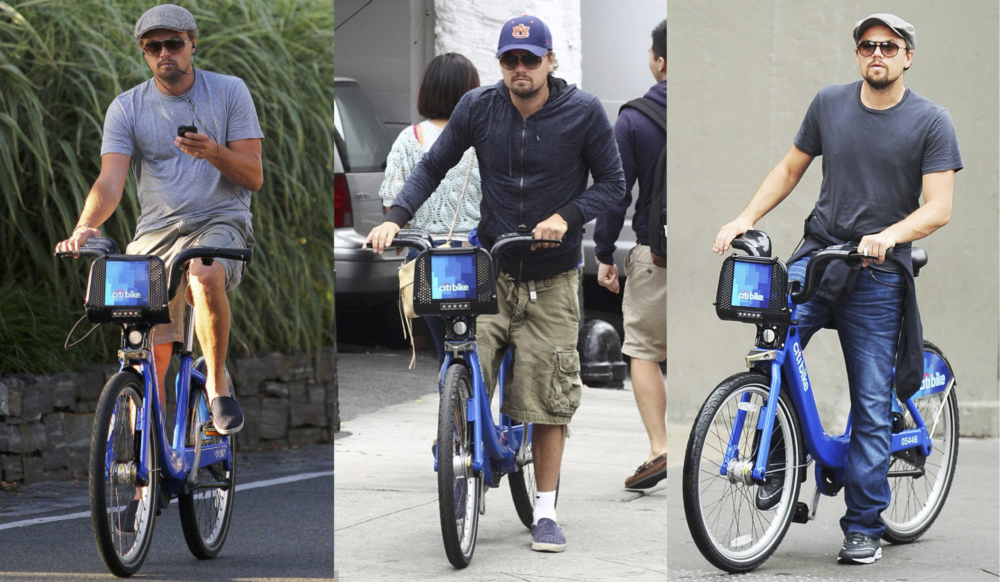

 

Eric D. Morris on Citi Bike

 

***

## Motivation

Since its launch in 2013, [CitiBike]("https://www.citibikenyc.com/") has proved to be a popular and essential addition to the New York City transportation network. As of late 2017, the CitiBike program reports 12,000 bikes and 750 stations in use across 60 NYC neighborhoods. The program continues to expand to new locations across the city each year and provides a valuable, environmentally-friendly, and cost-effective alternative form of transportation to New Yorkers. 

Lyft, the ride-share company, [announced](https://www.theverge.com/2018/7/2/17526892/lyft-buys-motivate-bike-sharing-expansion) its plans to purchase Motivate (Citi Bike's parent company) in July 2018, and the acquisition was finalized this November. With the help of a five-year $100 million [investment](https://www.theverge.com/2018/11/29/18118057/citi-bike-lyft-triple-size-100-million-investment-nyc) from its new owner, CitiBike plans to grow to 40,000 bikes and double its service area by 35 square miles. This significant expansion will turn CitiBike into one of the largest bike-share programs in the world.
 

***

## Scope of work

As avid bikers and customers of CitiBike, we wanted to explore how use of CitiBikes vary across neighborhoods, genders, ages, and across time. We were specifically interested in how CitiBike members -- New York local who pay either by month or by year to access unlimited 45 minute rides -- utilized the service in the beginning months (January and March) of 2017. Due to the nature of the service, we restricted our analyses to trips lasting longer than 5 minutes and shorter than 45 minutes.

***

## Data

Data for this project was obtained from [the company's system data website](https://s3.amazonaws.com/tripdata/index.html), which is provided according to the [NYCBS Data Use Policy](https://www.citibikenyc.com/data-sharing-policy). We downloaded CSV zip files of CitiBike data for the corresponding months of interest in 2017. 

Originally, we felt it was better to download directly from the data source for reproducibility purposes. However, when using read_csv with the direct URL to the zip, there were several parsing errors and the import failed. This may be due to the size of the files (zips vary from 25-70 MB). As such, we decided to download the zips of two months of interest and add them to our project's data folder and import from there.