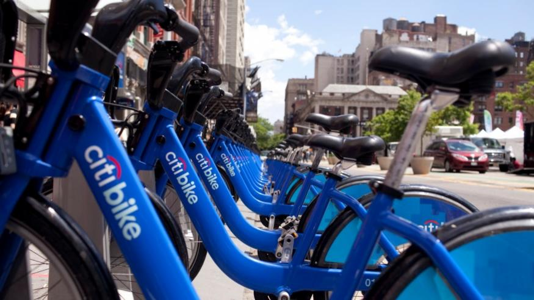
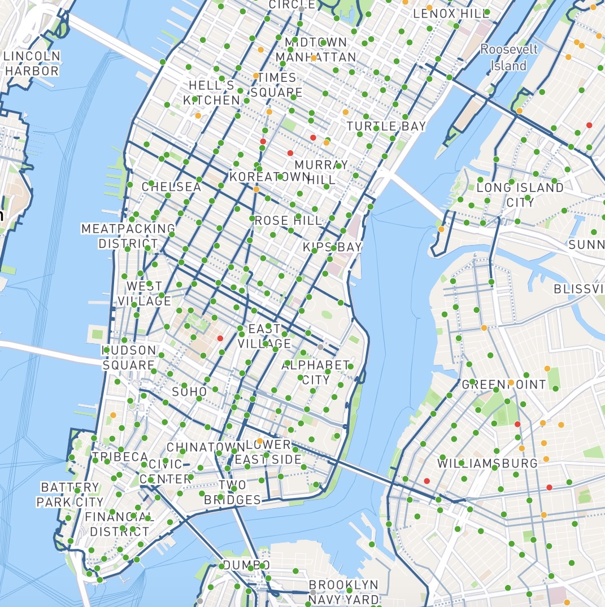

  

<h1>The (Bi)Cycles of Life:</h1>
<h2>An Analysis of NYC Citi Bike System Data</h2>

  

***

 

## Project Overview

Since its launch in 2013, Citi Bike has proved to be a popular and essential addition to the New York City transportation network. As of late 2017, the Citi Bike program reports 12,000 bikes and 750 stations in use across 60 NYC neighborhoods. The program continues to expand to new locations across the city each year and provides a valuable, environmentally-friendly, and cost-effective alternative form of transportation to New Yorkers. As avid bikers and customers of Citi Bike, our team is interested in exploring how use of Citi Bikes vary across neighborhoods, genders, ages, and across time.  

 

***

 

